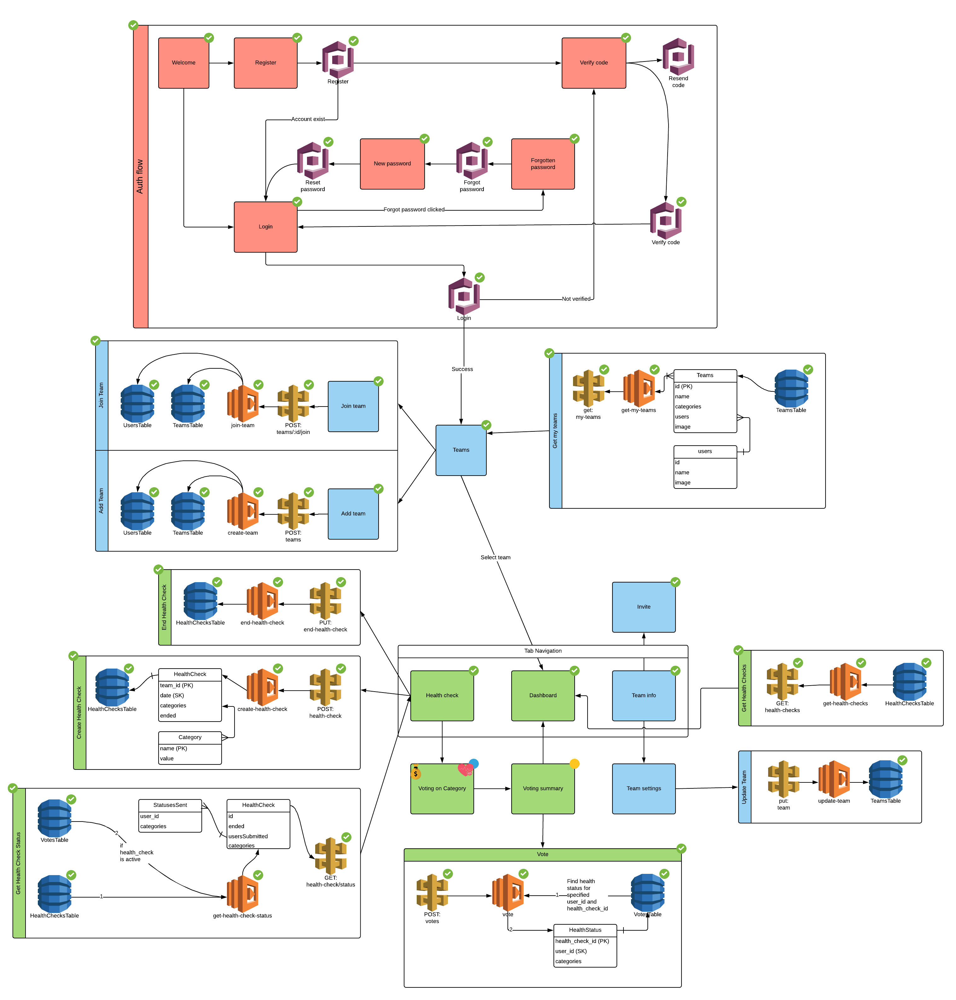

# Team Health Check: Serverless backend

## Getting started
This project is fully automated.
It means you can build it on your AWS account with a single command.

1. Go to functions directory
1. Run `npm i`
1. Run `npm run dev`
1. Copy Api Gateway url, Cognito pool ID and Cognito client ID from the
CloudFormation stack output and set them inside .env of Team Health Check-mobile project.